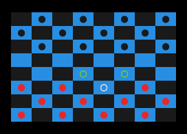
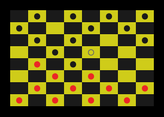
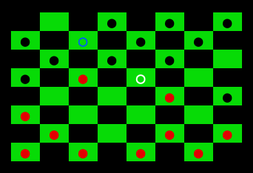
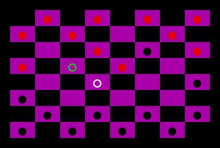
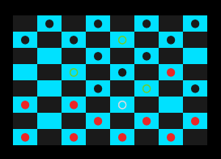
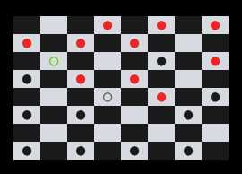

# checkers.py

[Board games collection repo](https://github.com/Bloumbs/board-games)

USAGE:

```shell
$ ./play.py -r -c 44      # Play against random moves with board color blue.

$ ./play.py -r -m         # Play against random moves with random board color, and disable showing available moves.

$ ./play.py -d .1 -s      # Simulate random moves game with delay of .1, and random board color.
```

```
$ ./play.py -h

usage: play.py [-h] [-V] [-r] [-e] [-s] [-d DELAY] [-c [{42,43,44,45,46,47}]]
               [-l] [-m]

Play Checkers in the terminal. Written in Python.

optional arguments:
  -h, --help            show this help message and exit
  -V, --version         show script version
  -r, --random          play against random moves
  -e, --extra           show extra game info after win
  -s, --sim             simulate random moves game
  -d DELAY, --delay DELAY
                        delay between moves played in simulated game
  -c [{42,43,44,45,46,47}], --color [{42,43,44,45,46,47}]
                        choose to select one color for the style of game,
                        instead of random on load
  -l, --log             disable logging of games to logs/ for highscore
  -m, --moves           disable showing of available moves in game
```

# LOOKS:

 

 

 