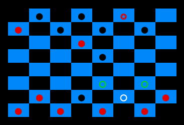
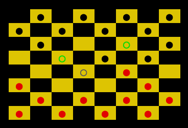
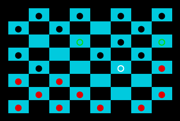
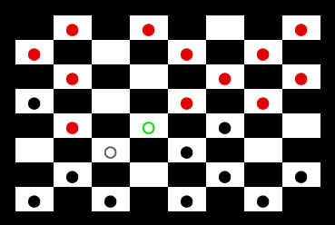

# checkers.py

```
usage: play.py [-h] [-r] [-s] [-d] [-c [{43,44,45,46,47}]] [-l] [-m]

optional arguments:
  -h, --help            show this help message and exit
  -r, --random          play against random moves
  -s, --sim             simulate random moves game
  -d, --delay           delay between moves played in simulated game
  -c [{43,44,45,46,47}], --color [{43,44,45,46,47}]
                        choose to select one color for the style of game,
                        instead of random on load
  -l, --log             disable logging of games to logs/ for highscore
  -m, --moves           disable showing of available moves in game
```

Play against random moves with board color blue:

```shell
$ ./play.py -r -c 44      # Play against random moves with board color blue.

$ ./play.py -r -m         # Play against random moves with random board color, and disable showing available moves.

$ ./play.py -d .1 -s      # Simulate random moves game with delay of .1, and random board color.
```

# LOOKS:

 

 

 